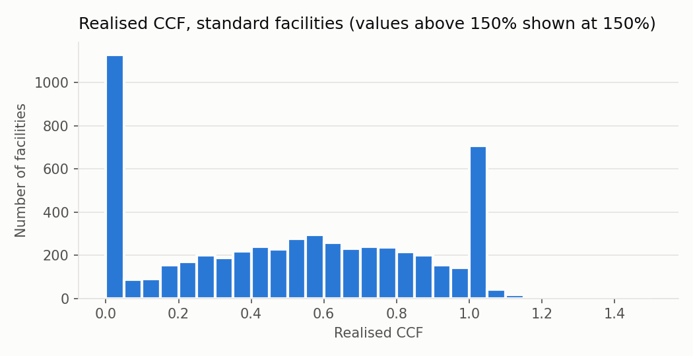
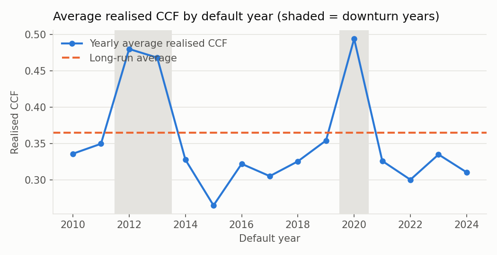
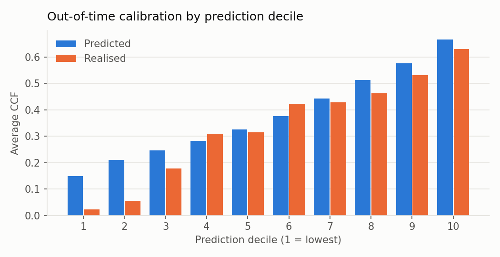

# EAD-CCF Model — Development Documentation (PROTOTYPE)

> **Status: PROTOTYPE ON SYNTHETIC DATA — NOT AN APPROVED MODEL.**
> All data in this document is synthetic. The document shows the structure,
> tests and traceability expected for internal validation and ECB review.
> Every number is generated by `python/run_pipeline.py`; nothing is typed by hand.

| Item | Value |
|---|---|
| Model | Own-estimate CCF for undrawn revolving commitments (A-IRB) |
| Portfolio | BNP Paribas Fortis revolving portfolios (prototype scope: 4 synthetic products) |
| Model owner | *to be filled* |
| Developer | *to be filled* |
| Document generated | 2026-09-28 |
| Code version | see git commit hash of this file |
| Random seed | 20260928 |

---

## 1. Executive summary

- Reference data set: **8,000 defaulted facilities**, default years 2010–2024; development sample 6,583, out-of-time sample (default year ≥ 2022) 1,417.
- Realised CCF follows the CRR3 facility-level definition with a 12-month fixed horizon. 639 facilities lie in the region of instability and 813 were fully drawn at reference date; both use a stabilised denominator (decision D003).
- Selected risk-differentiation model: **fractional_logit** (method ladder, section 5). Out-of-time MAE 0.3651 vs benchmark 0.3822; Spearman 0.344 vs 0.206.
- Downturn years: data-driven [2012, 2020], macro candidates [2012, 2013, 2020], selected [2012, 2013, 2020].
- Final CCFs include calibration to the long-run average, an additive downturn add-on, MoC (categories A+B+C) and the CRR3 input floor (50% × SA CCF).
- On the synthetic performing portfolio, IRB EAD is **103.7%** of standardised EAD; the input floor binds for 0.0% of facilities.
- Out-of-time calibration t-test: 0 of 12 segments show significant underestimation before downturn/MoC; after final adjustments: 0 of 12.

## 2. Scope and regulatory framework

| Topic | Reference |
|---|---|
| Scope of own CCF estimates (revolving commitments), input floor | CRR (575/2013) as amended by CRR3 (2024/1623), Art. 166 — *verify paragraph numbers* |
| Realised CCF definition | CRR3 Art. 4(1)(56) |
| Own CCF estimation requirements | CRR Art. 179, Art. 182 |
| Detailed CCF methodology | EBA draft Guidelines on CCF estimation, EBA/CP/2025/10 (consultation, July 2025) — **check whether final Guidelines are published** |
| MoC framework, general estimation principles | EBA/GL/2017/16 |
| Assessment methodology | Commission Delegated Regulation (EU) 2022/439 |
| ECB supervisory expectations | ECB Guide to internal models release 4.1 (June 2026) withdrew CCF guidance pending EBA Guidelines |

## 3. Data

### 3.1 Reference data set
One record per defaulted facility with values at the reference date (default date − 12 months) and at default. Source: `data/raw/defaults.csv` (synthetic, `python/ead_ccf/synthetic_data.py`).

### 3.2 Data quality checks
| check | n_fail | pct_fail |
|---|---|---|
| DQ01 missing facility_id | 0 | 0.000 |
| DQ02 duplicate facility_id | 0 | 0.000 |
| DQ03 limit_ref <= 0 | 0 | 0.000 |
| DQ04 drawn_ref < 0 | 0 | 0.000 |
| DQ05 drawn_ref > limit_ref | 0 | 0.000 |
| DQ06 ead_default < 0 | 0 | 0.000 |
| DQ07 reference_date >= default_date | 0 | 0.000 |
| DQ08 missing grade_ref | 161 | 2.013 |
| DQ09 grade_ref outside 1-12 | 0 | 0.000 |
| DQ10 missing ead_default | 0 | 0.000 |

Missing ratings are imputed with the development-sample median plus a missing-indicator variable, and trigger MoC category A (section 6.4).

### 3.3 Population by product and facility type
| product | facility_type | n_facilities | sum_limit_ref | sum_drawn_ref | sum_ead_default | mean_ccf_realised |
|---|---|---|---|---|---|---|
| CORP_RCF | FULLY_DRAWN | 141 | 290,087,420 | 290,087,420 | 285,210,782 | 0.3602 |
| CORP_RCF | ROI | 83 | 153,952,960 | 149,621,794 | 148,883,697 | 0.2764 |
| CORP_RCF | STANDARD | 939 | 2,190,999,090 | 823,287,766 | 1,441,007,814 | 0.4077 |
| RET_CARD | FULLY_DRAWN | 232 | 933,750 | 933,750 | 934,995 | 0.4099 |
| RET_CARD | ROI | 192 | 815,630 | 795,616 | 789,508 | 0.3246 |
| RET_CARD | STANDARD | 1931 | 7,755,130 | 4,808,413 | 6,080,523 | 0.3211 |
| RET_OVD | FULLY_DRAWN | 288 | 845,510 | 845,510 | 838,944 | 0.2835 |
| RET_OVD | ROI | 226 | 665,120 | 647,209 | 642,075 | 0.3026 |
| RET_OVD | STANDARD | 2359 | 6,973,310 | 3,739,465 | 5,276,838 | 0.3905 |
| SME_CRL | FULLY_DRAWN | 152 | 12,538,420 | 12,538,420 | 12,596,803 | 0.4392 |
| SME_CRL | ROI | 138 | 11,449,150 | 11,160,364 | 11,133,368 | 0.3544 |
| SME_CRL | STANDARD | 1319 | 109,141,100 | 52,481,077 | 77,513,218 | 0.3809 |

## 4. Realised CCF

**Definition.** realised CCF = (drawn at default − drawn at reference) / (limit at reference − drawn at reference).

| Facility type | Rule | Treatment (decision D003) |
|---|---|---|
| STANDARD | utilisation < 95% | raw definition |
| ROI | 95% ≤ utilisation < 100% | denominator = max(undrawn, 5% × limit) |
| FULLY_DRAWN | undrawn = 0 | denominator = 5% × limit |

Floor: negative CCFs (repayments) are kept for STANDARD facilities and floored at 0% for ROI / FULLY_DRAWN facilities; cap: none — CCFs above 100% are kept (decision D002). For the fractional-logit fit only, the target is restricted to [0, 100%]; calibration to the long-run average uses the unrestricted values, so the restriction does not change the final level.

| product | facility_type | n | mean | p25 | median | p75 | share_zero | share_ge_one | share_negative_raw |
|---|---|---|---|---|---|---|---|---|---|
| CORP_RCF | FULLY_DRAWN | 141 | 0.3602 | 0.0000 | 0.0000 | 0.3246 | 0.6950 | 0.1418 | 0.5035 |
| CORP_RCF | ROI | 83 | 0.2764 | 0.0000 | 0.0000 | 0.1098 | 0.6988 | 0.0602 | 0.4337 |
| CORP_RCF | STANDARD | 939 | 0.4077 | 0.0635 | 0.4254 | 0.7256 | 0.1374 | 0.1118 | 0.0927 |
| RET_CARD | FULLY_DRAWN | 232 | 0.4099 | 0.0000 | 0.0000 | 0.3412 | 0.6336 | 0.1466 | 0.3664 |
| RET_CARD | ROI | 192 | 0.3246 | 0.0000 | 0.0000 | 0.2107 | 0.6771 | 0.1198 | 0.4062 |
| RET_CARD | STANDARD | 1931 | 0.3211 | 0.0000 | 0.4154 | 0.7368 | 0.1895 | 0.1150 | 0.1238 |
| RET_OVD | FULLY_DRAWN | 288 | 0.2835 | 0.0000 | 0.0000 | 0.2342 | 0.6910 | 0.1181 | 0.4340 |
| RET_OVD | ROI | 226 | 0.3026 | 0.0000 | 0.0000 | 0.2306 | 0.6770 | 0.1150 | 0.4248 |
| RET_OVD | STANDARD | 2359 | 0.3905 | 0.0000 | 0.5030 | 0.8204 | 0.1594 | 0.1314 | 0.1348 |
| SME_CRL | FULLY_DRAWN | 152 | 0.4392 | 0.0000 | 0.0000 | 0.5005 | 0.6316 | 0.1513 | 0.3882 |
| SME_CRL | ROI | 138 | 0.3544 | 0.0000 | 0.0000 | 0.4003 | 0.6159 | 0.1087 | 0.3551 |
| SME_CRL | STANDARD | 1319 | 0.3809 | 0.0000 | 0.4333 | 0.7380 | 0.1531 | 0.1130 | 0.1259 |

The distribution is bimodal with mass at 0 and at 1, as reported by Tong et al. (2016); normal-error models are therefore not used.

## 5. Risk differentiation

### 5.1 Method ladder
1. Benchmark — segment long-run average (product × utilisation band).
2. Fractional logit (Papke & Wooldridge, 1996) with robust standard errors — replaces the benchmark only if it improves **both** out-of-time MAE and Spearman correlation.
3. Direct-EAD alternatives (Taplin et al., 2007; Tong et al., 2016) — *not yet implemented, open issue*.
4. Gradient boosting with monotonic constraints — challenger for driver discovery only.

Candidate drivers are restricted to information available at the reference date. `limit_cut_flag` is excluded because the limit cut happens after the reference date (decision D006).

### 5.2 Performance on standard facilities (models calibrated to segment LRA on development sample)
| model | sample | n | mean_realised | mean_predicted | MAE | RMSE | R2 | spearman | EAD_pred_over_actual |
|---|---|---|---|---|---|---|---|---|---|
| fractional_logit | DEV | 5378 | 0.3782 | 0.3782 | 0.3777 | 0.4986 | 0.1198 | 0.3324 | 0.9925 |
| fractional_logit | OOT | 1170 | 0.3353 | 0.3784 | 0.3651 | 0.4853 | 0.1195 | 0.3441 | 1.1218 |
| gbm_challenger | DEV | 5378 | 0.3782 | 0.3782 | 0.3684 | 0.4900 | 0.1497 | 0.3843 | 0.9851 |
| gbm_challenger | OOT | 1170 | 0.3353 | 0.3803 | 0.3647 | 0.4854 | 0.1189 | 0.3358 | 1.1211 |
| benchmark | DEV | 5378 | 0.3782 | 0.3782 | 0.3966 | 0.5153 | 0.0596 | 0.1964 | 0.9725 |
| benchmark | OOT | 1170 | 0.3353 | 0.3809 | 0.3822 | 0.5023 | 0.0567 | 0.2064 | 1.0948 |

**Selected model: fractional_logit.**

### 5.3 Fractional logit — final estimates (full sample)
| variable | coefficient | robust_se | z_value | p_value |
|---|---|---|---|---|
| intercept | -0.7250 | 0.2550 | -2.8433 | 0.0045 |
| utilisation | -1.8064 | 0.0872 | -20.7084 | 0.0000 |
| log_limit | 0.0309 | 0.0269 | 1.1497 | 0.2503 |
| grade_missing | 0.2362 | 0.1299 | 1.8187 | 0.0690 |
| grade | 0.1463 | 0.0079 | 18.5482 | 0.0000 |
| arrears_6m | 0.5086 | 0.0407 | 12.4898 | 0.0000 |
| log_mob | -0.0322 | 0.0275 | -1.1716 | 0.2414 |
| prod_RET_CARD | -0.0787 | 0.0480 | -1.6396 | 0.1011 |
| prod_SME_CRL | -0.3613 | 0.0997 | -3.6246 | 0.0003 |
| prod_CORP_RCF | -0.6706 | 0.1828 | -3.6680 | 0.0002 |

- `utilisation`: expected sign −, estimated − (as expected), p = 0.0000
- `grade`: expected sign +, estimated + (as expected), p = 0.0000
- `arrears_6m`: expected sign +, estimated + (as expected), p = 0.0000
- Not significant at 5%: log_limit, grade_missing, log_mob, prod_RET_CARD. Candidates for removal at checkpoint C. (In the synthetic data-generating process, `log_limit` and `log_mob` have no true effect, so their non-significance is a check that the estimation recovers the truth.)

### 5.4 Gradient-boosting challenger — permutation importance (OOT)
| variable | mae_increase | std |
|---|---|---|
| utilisation | 0.0246 | 0.0030 |
| grade | 0.0174 | 0.0030 |
| arrears_6m | 0.0074 | 0.0012 |
| log_limit | 0.0029 | 0.0021 |
| log_mob | 0.0014 | 0.0010 |
| prod_RET_CARD | 0.0003 | 0.0002 |
| prod_CORP_RCF | 0.0002 | 0.0002 |
| prod_SME_CRL | -0.0001 | 0.0001 |
| grade_missing | -0.0001 | 0.0002 |

Top-3 drivers by permutation importance: utilisation, grade, arrears_6m. The challenger is used to check that no important driver or non-linearity is missing from the fractional logit; it is not proposed for production.

## 6. Risk quantification

### 6.1 Long-run average by segment (both weighting methods)
| calib_segment | n_facilities | lra_facility_weighted | n_years | lra_yearly_average | difference |
|---|---|---|---|---|---|
| CORP_RCF/U1_lt50 | 654 | 0.4679 | 15 | 0.4545 | 0.0135 |
| CORP_RCF/U2_50_95 | 285 | 0.2694 | 15 | 0.2592 | 0.0102 |
| CORP_RCF/U3_ge95 | 224 | 0.3292 | 15 | 0.3155 | 0.0136 |
| RET_CARD/U1_lt50 | 553 | 0.5367 | 15 | 0.5254 | 0.0113 |
| RET_CARD/U2_50_95 | 1378 | 0.2346 | 15 | 0.2233 | 0.0113 |
| RET_CARD/U3_ge95 | 424 | 0.3713 | 15 | 0.3378 | 0.0335 |
| RET_OVD/U1_lt50 | 996 | 0.5472 | 15 | 0.5448 | 0.0024 |
| RET_OVD/U2_50_95 | 1363 | 0.2760 | 15 | 0.2725 | 0.0035 |
| RET_OVD/U3_ge95 | 514 | 0.2919 | 15 | 0.2867 | 0.0052 |
| SME_CRL/U1_lt50 | 711 | 0.4870 | 15 | 0.4804 | 0.0066 |
| SME_CRL/U2_50_95 | 608 | 0.2568 | 15 | 0.2450 | 0.0118 |
| SME_CRL/U3_ge95 | 290 | 0.3988 | 15 | 0.3674 | 0.0315 |

Selected method: **facility_weighted** (decision D005). The column `difference` shows the impact of the choice.

### 6.2 Calibration factors
| calib_segment | calibration_factor |
|---|---|
| CORP_RCF/U1_lt50 | 0.9661 |
| CORP_RCF/U2_50_95 | 0.8315 |
| RET_CARD/U1_lt50 | 1.0003 |
| RET_CARD/U2_50_95 | 0.6297 |
| RET_OVD/U1_lt50 | 0.9804 |
| RET_OVD/U2_50_95 | 0.6799 |
| SME_CRL/U1_lt50 | 0.9588 |
| SME_CRL/U2_50_95 | 0.7349 |

### 6.3 Downturn
Downturn years: data-driven (top 2 years by average realised CCF) = [2012, 2020]; macro candidates = [2012, 2013, 2020]; selected (union) = [2012, 2013, 2020].

| calib_segment | lra | n_downturn_obs | downturn_observed | fallback_portfolio_ratio | downturn_ccf | downturn_addon |
|---|---|---|---|---|---|---|
| CORP_RCF/U1_lt50 | 0.4679 | 192 | 0.5657 | 0 | 0.5657 | 0.0978 |
| CORP_RCF/U2_50_95 | 0.2694 | 84 | 0.3544 | 0 | 0.3544 | 0.0850 |
| CORP_RCF/U3_ge95 | 0.3292 | 59 | 0.5587 | 0 | 0.5587 | 0.2296 |
| RET_CARD/U1_lt50 | 0.5367 | 166 | 0.6451 | 0 | 0.6451 | 0.1084 |
| RET_CARD/U2_50_95 | 0.2346 | 376 | 0.3401 | 0 | 0.3401 | 0.1056 |
| RET_CARD/U3_ge95 | 0.3713 | 131 | 0.6067 | 0 | 0.6067 | 0.2354 |
| RET_OVD/U1_lt50 | 0.5472 | 262 | 0.6335 | 0 | 0.6335 | 0.0863 |
| RET_OVD/U2_50_95 | 0.2760 | 353 | 0.3522 | 0 | 0.3522 | 0.0763 |
| RET_OVD/U3_ge95 | 0.2919 | 124 | 0.4154 | 0 | 0.4154 | 0.1235 |
| SME_CRL/U1_lt50 | 0.4870 | 196 | 0.5615 | 0 | 0.5615 | 0.0744 |
| SME_CRL/U2_50_95 | 0.2568 | 167 | 0.3656 | 0 | 0.3656 | 0.1088 |
| SME_CRL/U3_ge95 | 0.3988 | 84 | 0.6721 | 0 | 0.6721 | 0.2732 |

### 6.4 Margin of conservatism
| calib_segment | n | lra | moc_A_data | moc_B_method | moc_C_estimation | moc_total |
|---|---|---|---|---|---|---|
| CORP_RCF/U1_lt50 | 654 | 0.4679 | 0.0004 | 0.0015 | 0.0179 | 0.0198 |
| CORP_RCF/U2_50_95 | 285 | 0.2694 | 0.0079 | 0.0006 | 0.0354 | 0.0439 |
| CORP_RCF/U3_ge95 | 224 | 0.3292 | 0.0040 | 0.1269 | 0.0662 | 0.1972 |
| RET_CARD/U1_lt50 | 553 | 0.5367 | 0.0008 | 0.0015 | 0.0212 | 0.0236 |
| RET_CARD/U2_50_95 | 1378 | 0.2346 | 0.0006 | 0.0019 | 0.0219 | 0.0243 |
| RET_CARD/U3_ge95 | 424 | 0.3713 | 0.0023 | 0.1521 | 0.0506 | 0.2050 |
| RET_OVD/U1_lt50 | 996 | 0.5472 | 0.0018 | 0.0025 | 0.0169 | 0.0213 |
| RET_OVD/U2_50_95 | 1363 | 0.2760 | 0.0019 | 0.0017 | 0.0219 | 0.0255 |
| RET_OVD/U3_ge95 | 514 | 0.2919 | 0.0047 | 0.0936 | 0.0368 | 0.1352 |
| SME_CRL/U1_lt50 | 711 | 0.4870 | 0.0041 | 0.0015 | 0.0192 | 0.0248 |
| SME_CRL/U2_50_95 | 608 | 0.2568 | 0.0063 | 0.0020 | 0.0281 | 0.0364 |
| SME_CRL/U3_ge95 | 290 | 0.3988 | 0.0011 | 0.1569 | 0.0615 | 0.2195 |

A = data deficiencies (missing ratings), B = methodological choice (cap at 100% vs none), C = general estimation error (bootstrap 1000 resamples, 90% quantile). **These are simple proxies for the prototype and must be replaced by the approved MoC framework.**

### 6.5 Final CCF by segment
| calib_segment | n | ccf_model | ccf_calibrated | downturn_addon | moc | input_floor | ccf_final | share_floor_binding |
|---|---|---|---|---|---|---|---|---|
| CORP_RCF/U1_lt50 | 654 | 0.4844 | 0.4679 | 0.0978 | 0.0198 | 0.2000 | 0.5855 | 0.0000 |
| CORP_RCF/U2_50_95 | 285 | 0.3239 | 0.2694 | 0.0850 | 0.0439 | 0.2000 | 0.3983 | 0.0000 |
| CORP_RCF/U3_ge95 | 224 | 0.3292 | 0.3292 | 0.2296 | 0.1972 | 0.2000 | 0.7559 | 0.0000 |
| RET_CARD/U1_lt50 | 553 | 0.5366 | 0.5367 | 0.1084 | 0.0236 | 0.0500 | 0.6686 | 0.0000 |
| RET_CARD/U2_50_95 | 1378 | 0.3725 | 0.2346 | 0.1056 | 0.0243 | 0.0500 | 0.3645 | 0.0000 |
| RET_CARD/U3_ge95 | 424 | 0.3713 | 0.3713 | 0.2354 | 0.2050 | 0.0500 | 0.8117 | 0.0000 |
| RET_OVD/U1_lt50 | 996 | 0.5581 | 0.5472 | 0.0863 | 0.0213 | 0.0500 | 0.6547 | 0.0000 |
| RET_OVD/U2_50_95 | 1363 | 0.4059 | 0.2760 | 0.0763 | 0.0255 | 0.0500 | 0.3778 | 0.0000 |
| RET_OVD/U3_ge95 | 514 | 0.2919 | 0.2919 | 0.1235 | 0.1352 | 0.0500 | 0.5506 | 0.0000 |
| SME_CRL/U1_lt50 | 711 | 0.5080 | 0.4870 | 0.0744 | 0.0248 | 0.2000 | 0.5863 | 0.0000 |
| SME_CRL/U2_50_95 | 608 | 0.3494 | 0.2568 | 0.1088 | 0.0364 | 0.2000 | 0.4020 | 0.0000 |
| SME_CRL/U3_ge95 | 290 | 0.3988 | 0.3988 | 0.2732 | 0.2195 | 0.2000 | 0.8916 | 0.0000 |

## 7. Performance testing

### 7.1 Out-of-time calibration test (calibrated model, before downturn and MoC)
| segment | n | mean_realised | mean_estimate | t_stat | p_value | result |
|---|---|---|---|---|---|---|
| CORP_RCF/U1_lt50 | 109 | 0.4045 | 0.4945 | -2.6277 | 0.9951 | ok |
| CORP_RCF/U2_50_95 | 58 | 0.2051 | 0.2905 | -1.3727 | 0.9124 | ok |
| CORP_RCF/U3_ge95 | 36 | 0.2269 | 0.3487 | -1.4419 | 0.9209 | ok |
| RET_CARD/U1_lt50 | 110 | 0.4796 | 0.5560 | -2.0058 | 0.9763 | ok |
| RET_CARD/U2_50_95 | 238 | 0.1948 | 0.2304 | -0.9841 | 0.8370 | ok |
| RET_CARD/U3_ge95 | 70 | 0.2873 | 0.3879 | -1.4348 | 0.9221 | ok |
| RET_OVD/U1_lt50 | 187 | 0.5082 | 0.5413 | -1.2466 | 0.8929 | ok |
| RET_OVD/U2_50_95 | 254 | 0.2350 | 0.2806 | -1.2300 | 0.8901 | ok |
| RET_OVD/U3_ge95 | 95 | 0.1257 | 0.3296 | -5.3799 | 1.0000 | ok |
| SME_CRL/U1_lt50 | 117 | 0.5078 | 0.4907 | 0.4838 | 0.3147 | ok |
| SME_CRL/U2_50_95 | 97 | 0.2378 | 0.2693 | -0.6123 | 0.7291 | ok |
| SME_CRL/U3_ge95 | 46 | 0.3148 | 0.4147 | -1.4407 | 0.9217 | ok |

### 7.2 Calibration test of final (conservative) CCFs, full sample
| segment | n | mean_realised | mean_estimate | t_stat | p_value | result |
|---|---|---|---|---|---|---|
| CORP_RCF/U1_lt50 | 654 | 0.4679 | 0.5855 | -8.5644 | 1.0000 | ok |
| CORP_RCF/U2_50_95 | 285 | 0.2694 | 0.3983 | -4.6412 | 1.0000 | ok |
| CORP_RCF/U3_ge95 | 224 | 0.3292 | 0.7559 | -8.2791 | 1.0000 | ok |
| RET_CARD/U1_lt50 | 553 | 0.5367 | 0.6686 | -8.4104 | 1.0000 | ok |
| RET_CARD/U2_50_95 | 1378 | 0.2346 | 0.3645 | -8.0109 | 1.0000 | ok |
| RET_CARD/U3_ge95 | 424 | 0.3713 | 0.8117 | -11.1404 | 1.0000 | ok |
| RET_OVD/U1_lt50 | 996 | 0.5472 | 0.6547 | -8.7904 | 1.0000 | ok |
| RET_OVD/U2_50_95 | 1363 | 0.2760 | 0.3778 | -6.3212 | 1.0000 | ok |
| RET_OVD/U3_ge95 | 514 | 0.2919 | 0.5506 | -9.2319 | 1.0000 | ok |
| SME_CRL/U1_lt50 | 711 | 0.4870 | 0.5863 | -7.1230 | 1.0000 | ok |
| SME_CRL/U2_50_95 | 608 | 0.2568 | 0.4020 | -6.8170 | 1.0000 | ok |
| SME_CRL/U3_ge95 | 290 | 0.3988 | 0.8916 | -9.8398 | 1.0000 | ok |

### 7.3 Decile calibration (out-of-time)

| bin | n | mean_predicted | mean_realised |
|---|---|---|---|
| 1 | 117 | 0.1480 | 0.0230 |
| 2 | 117 | 0.2096 | 0.0550 |
| 3 | 117 | 0.2460 | 0.1782 |
| 4 | 117 | 0.2827 | 0.3092 |
| 5 | 117 | 0.3257 | 0.3142 |
| 6 | 117 | 0.3763 | 0.4228 |
| 7 | 117 | 0.4420 | 0.4282 |
| 8 | 117 | 0.5128 | 0.4616 |
| 9 | 117 | 0.5752 | 0.5312 |
| 10 | 117 | 0.6661 | 0.6298 |

### 7.4 Stability of drivers (PSI, development vs out-of-time)
| variable | psi | assessment |
|---|---|---|
| utilisation | 0.0080 | stable |
| log_limit | 0.0142 | stable |
| grade_missing | 0.0073 | stable |
| grade | 0.0070 | stable |
| arrears_6m | 0.0019 | stable |
| log_mob | 0.0133 | stable |
| prod_RET_CARD | 0.0000 | stable |
| prod_SME_CRL | 0.0033 | stable |
| prod_CORP_RCF | 0.0000 | stable |

## 8. Application to the performing portfolio

| product | n | limit | drawn | mean_ccf_final | share_floor_binding | ead_irb | ead_sa | ead_irb_over_sa |
|---|---|---|---|---|---|---|---|---|
| CORP_RCF | 2965 | 6,803,513,520 | 2,684,264,430 | 0.4299 | 0.0020 | 4,477,458,897 | 4,331,964,066 | 1.0336 |
| RET_CARD | 5967 | 23,583,020 | 9,170,469 | 0.5235 | 0.0000 | 16,899,515 | 10,611,724 | 1.5925 |
| RET_OVD | 7034 | 21,383,430 | 8,316,879 | 0.4891 | 0.0000 | 15,094,194 | 9,623,534 | 1.5685 |
| SME_CRL | 4034 | 344,619,480 | 133,511,687 | 0.4637 | 0.0000 | 229,927,051 | 217,954,804 | 1.0549 |
| TOTAL | 20000 | 7,193,099,450 | 2,835,263,465 | 0.4855 | 0.0003 | 4,739,379,658 | 4,570,154,128 | 1.0370 |

## 9. Human judgement and decisions
All methodological choices are logged in `docs/decisions/`. Each entry lists the options considered, regulatory references, the proposal and the **human decision (pending)**.

## 10. Limitations and open issues
1. Synthetic data only — results say nothing about the real portfolio.
2. Draft EBA Guidelines used as blueprint; final Guidelines may change requirements (e.g. LRA weighting, RoI treatment, fixed-CCF options).
3. Realised CCF computed per facility; related-contract/umbrella treatment and borrower-level aggregation of restructured facilities not yet assessed against Art. 4(1)(56).
4. Additional drawings after default and in-default CCF not implemented.
5. Direct-EAD challengers (rung 3) not implemented.
6. MoC quantification uses simple proxies.
7. SA CCF buckets per product to be verified.
8. SAS implementation written but not yet run in the bank environment; reconciliation pending.

## 11. Reproducibility

| Step | Python | SAS |
|---|---|---|
| Configuration | `config/config.yaml` | `sas/00_config.sas` |
| Synthetic data | `python/ead_ccf/synthetic_data.py` | reads `data/raw/*.csv` |
| Realised CCF, DQ | `python/ead_ccf/realised_ccf.py` | `sas/02_realised_ccf.sas` |
| Segmentation, LRA | `python/ead_ccf/segmentation.py`, `lra.py` | `sas/03_lra.sas` |
| Fractional logit | `python/ead_ccf/models.py` | `sas/04_fractional_logit.sas` |
| Downturn, MoC, floor | `python/ead_ccf/quantification.py` | `sas/05_quantification.sas` |
| Performance tests | `python/ead_ccf/validation.py` | `sas/06_validation.sas` |
| Reconciliation | `python/reconcile.py` | `sas/07_export_recon.sas` |

Environment: python 3.11.15, numpy 2.4.4, pandas 3.0.2, scipy 1.17.1, scikit-learn 1.8.0.

## Annex A — Literature
- Papke, L.E. & Wooldridge, J.M. (1996). Econometric methods for fractional response variables. *Journal of Applied Econometrics*.
- Taplin, R., To, H.M. & Hee, J. (2007). Modeling exposure at default, credit conversion factors and the Basel II Accord. *Journal of Credit Risk*, 3, 75–84.
- Tong, E.N.C., Mues, C., Brown, I. & Thomas, L.C. (2016). Exposure at default models with and without the credit conversion factor. *European Journal of Operational Research*, 252(3), 910–920.
- Gürtler, M., Hibbeln, M.T. & Usselmann, P. (2018). Exposure at default modeling — a theoretical and empirical assessment of estimation approaches and parameter choice. *Journal of Banking & Finance*.
- Wattanawongwan, S., Mues, C., Okhrati, R., Choudhry, T. & So, M.C. (2023). A mixture model for credit card exposure at default using the GAMLSS framework. *International Journal of Forecasting*.
